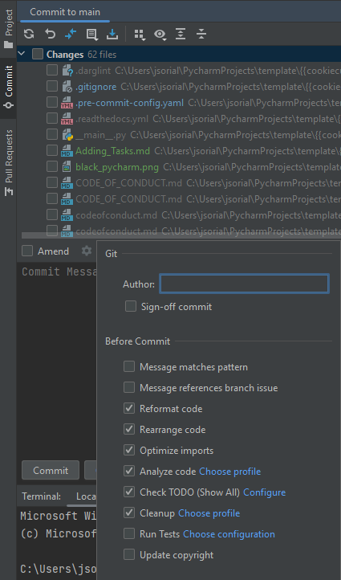
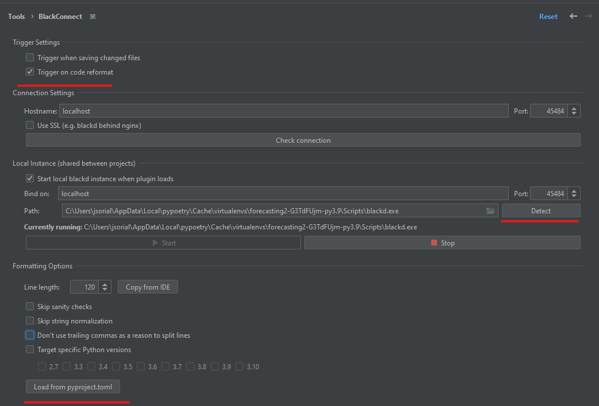

# Pycharm Setup

To me the most productive get PyCharm :)

# 1. Setting up Pycharm's local pre-commit actions

There are actions that need to be done on every commit.
The installed pre-commit hooks that we installed will cancel a commit if it
doesn't adhere to black's formatting.
Pycharm can run some of these rules automatically to make you pass the pipeline for frequently.

Go to the commit window on the left and press on the cog and check these checkmarks

# 2. Setting up black

For formatting the project uses the [Black](https://github.com/psf/black) as a code formatter.

1. Open PyCharm's Settings
2. Install the BlackConnect PyCharm plugin.
3. Open CMD terminal and type out `where blackd` and copy the path
4. Open The Settings
5. Paste the copied path into Path
6. Check all the checkmarks that are in the picture.
7. Click on the load from pyproject.toml button to load the black configuration for your project.

## Why is formatting important?

It prevents merge conflicts by unifying the formatting of python projects so your commits only contain actual changes
without the differences in white spaces and formatting which is for git history purposes useless.

## I don't like black, can I configure it?

No black is strongly opinionated on how code is supposed to look to eliminate time wasted discussing formatting
It has very little configurations options. Usually you don't like black for the first 10 minutes of using it.
Afterwards you will get used to it and like it.
